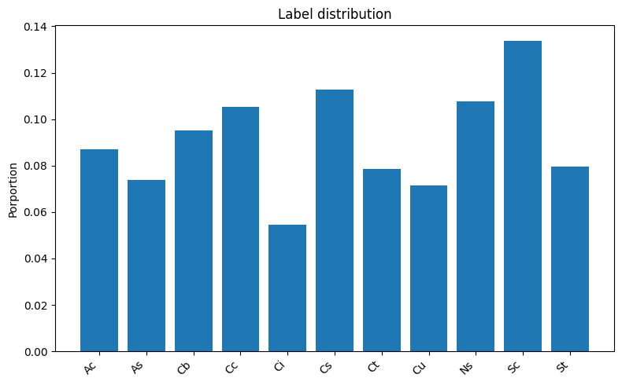
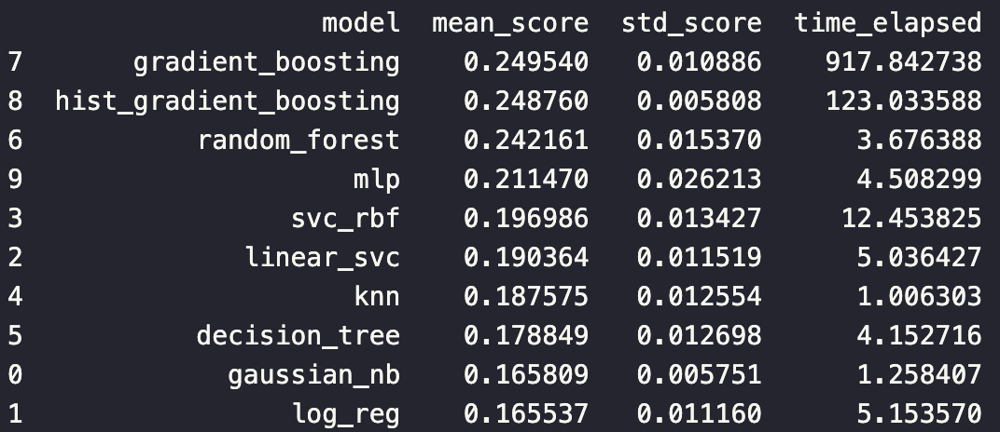
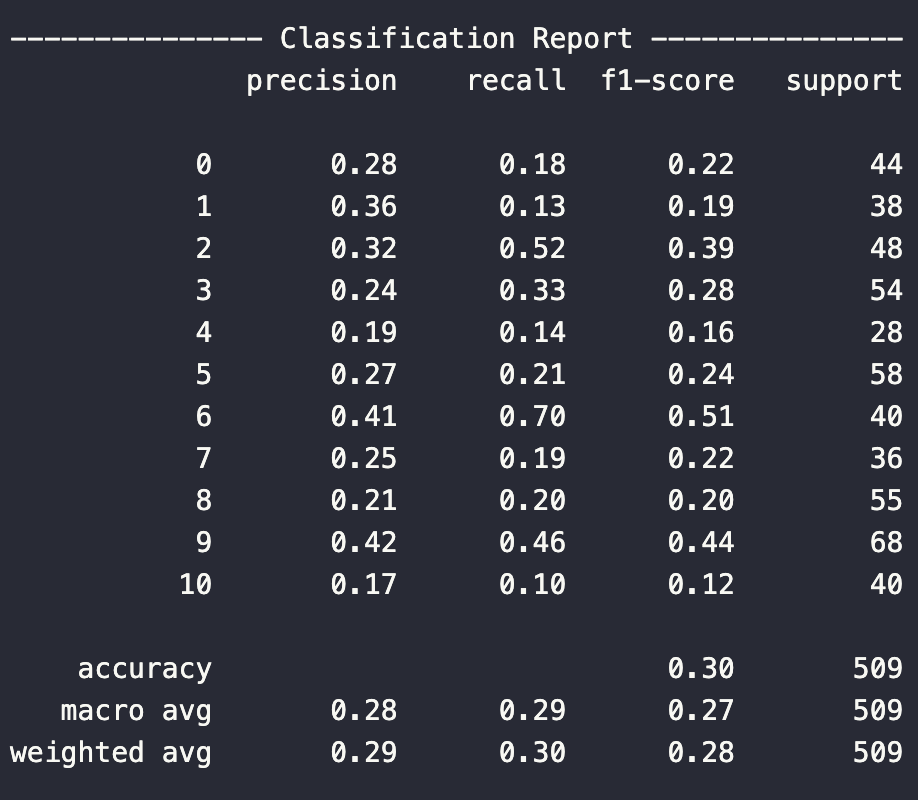
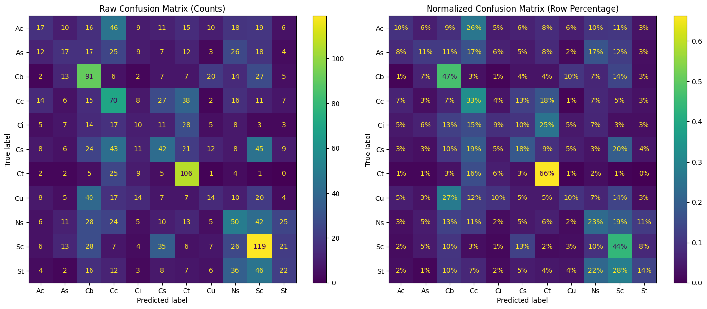
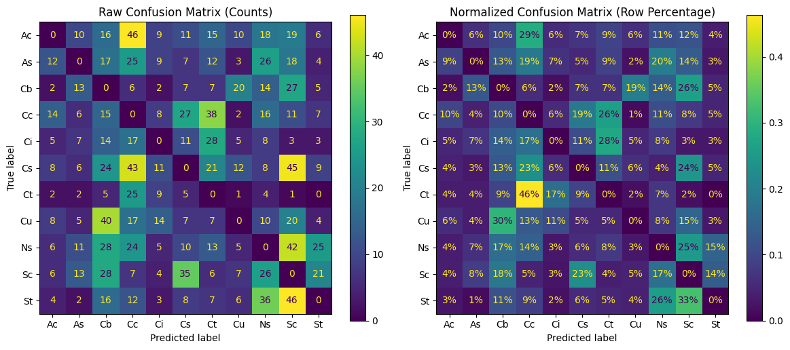
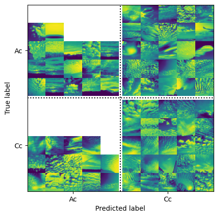

# Belle Weder

## TL;DR
After experiencing dangerous weather in rural Cameroon with no mobile service, this project explores offline, hyperlocal weather prediction using computer vision.

Instead of relying on heavy physics-based forecasts, it looks at predicting local weather by simply identifying cloud types from sky pics.

My early experiments use the CCSN cloud image dataset and lightweight machine-learning models to run on modest hardware. So far, performance is low (~25% F1 score), mainly due to limited data, low image resolution, and similar-looking cloud types.

Next, the focus is on improving results with transfer learning, data augmentation, and better image processing to eventually deliver accurate forecasts on any low-cost device.

## Predict the Weather at the Click of a Shutter
When I travelled back to Cameroon this summer to see my family, I visited my family village. It was a 5-hour drive from Yaounde, where we were staying.

After the visit, on our way back from the village, we observed dark-ish clouds on the horizon. However, we weren’t sure if they were rain clouds, and we weren’t sure if they would hit us. (PS: Yes, they were rain clouds. Yes, they did hit us - big time.)

In the moment, we couldn’t check the weather due to the lack of service in the region. Thankfully, we were fine most of the way, apart from two tire punctures, but other travellers weren’t as lucky. We observed mudslides, flooding, mini-buses being pushed in the hills, people standed on the side of the road, ...

Hence the idea for this project. It aims to predict weather at a hyperlocal scale with computer vision, with no need for service.

###  How do we get our weather forecasts in the first place? Physics!

The way meteorological institutions like the UK Met Office or the US National Center for Atmospheric Research get us our weather forecasts is through the use of complex physics formulas (Numerical Weather Prediction - NWP) that are run through supercomputers.

These organisations receive an insane amount of current atmospheric data (temperature, humidity, air pressure, and much more). From this data, they can forecast weather from a few hours in advance to hundreds of years. These calculations are run multiple times a day, the forecasts are continuously monitored and updated to validate accuracy, as new data comes is recorded.

### Is Machine Learning used at all?

The standard NWP methods we use are very resource intensive (time and computation), and are still prone to errors. ML has been used in the field but has usually come out with blurry forecasts (too vague) which haven’t been able to rival classic NWP forecasts. That is, until Google's GenCast. GenCast is an AI Based weather prediction model trained on 40 years of historical weather data. It can predict weather up to 15 days in advance with the same or higher accuracy than physics based forecasts.

### Going Hyperlocal by Identifying Clouds
Google GenCast reaches a prediction resolution of ~ 28 x 28 km. Global NWP models reach a resolution of ~ 1 - 4 km^2.

Is there a way to bridge that gap? Well, why not get hyperlocal weather predictions with Machine Learning models through computer vision. Imagine this:
- You take a picture of the sky
- The cloud formation is identified
- That cloud formation data is combined with current atmospheric conditions  (wind speed, temperature, pressure, humidity) - either hyperlocal or taken from open sources
- Predict the weather

Note: With this image data, prediction resolution could improve to a hopeful <4 km^2.

### Applications of the Project
- Better weather predictions, especially in regions where localised weather effects are prevalent - i.e. mountains, regions where there is sparse data due to lack of ground instrumentation (i.e. Arctic, oceans, deserts, developing countries, …)
- Weather prediction in and by the sea - extremely hard to do forecasting there
- Commodities trading (e.g. energy and agricultural products) as the result of the above

*What's the ideal end state of this project?*
- Create a consumer application that users can use to identify clouds and get weather predictions. For this, the model would ideally need:
    - High accuracy >90%
    - Low hardware requirements (i.e. low resolution camera, low power processing unit, etc) - so that the model can run on the worst performing devices in use in Africa
- Create a standalone device that can be attached to urban and in nature furniture and infrastructure (street poles, watchtowers, buoys in the sea, boat masts, etc…) to continuously take measures and make predictions.

## So, what have I wrought so far?
### Computer Vision
*Chose a starting dataset*
For the computer vision side of this project, we’re using the CCSN dataset of cloud images.

The CCSN dataset contains 2543 cloud images divided into 12 categories: Ac, Sc, Ns, Cu, Ci, Cc, Cb, As, Ct, Cs, St. Ci = cirrus; Cs = cirrostratus; Cc = cirrocumulus; Ac = altocumulus; As = altostratus; Cu = cumulus; Cb = cumulonimbus; Ns = nimbostratus; Sc = stratocumulus; St = stratus; Ct = contrail. All images are fixed resolution 256×256 pixels with the JPEG format.



*Why this dataset?*
Different types of clouds can give us clues about what is happening in the atmosphere – and what we can expect the weather to do.

Clouds such as Cumulus, Altocumulus, and Cirrocumulus forecast fair weather.

On the other hand, clouds like Altostratus and Nimbostratus are signs of continuous rain or snow.

And Cumulonimbus signal thunderstorms, hail, and tornados.

*I tested out a few different models*
The models I chose to work with and fine tune had to not only be precise, but they also need to be trainable on my laptop. The latter is where the time elapsed column is important, as the longer the run, the less likely my laptop will finish it without timing out.

```python
evaluate_classifiers(X, y, scoring: str = "f1_macro", cv: int = 3, n_jobs: int = -1, random_state: int = 42, verbose: int = 1 )
```
The function returns a sorted dataframe of cross-validation results from the most common classification models with default hyperparameters.

The models are:
- Gaussian Naive Bayes
- Logistic Regression
- Linear Support Vector
- Support Vector Classification
- K Nearest Neighbours
- Decision Tree
- Random Forest
- Gradient Boosting
- Histogram Gradient Boosting
- Multi-layer Perceptron



In this case, I chose to explore random forest (and mlp further).

### Results
*Exploring Random Forest*
Through a combination of of grid search and random search - optimising for the f1_score, the best model found had the following hyperparameters and score:
```
({'bootstrap': False,
  'class_weight': 'balanced',
  'max_depth': 21,
  'max_features': 'sqrt',
  'min_samples_leaf': 3,
  'min_samples_split': 2,
  'n_estimators': 247},
 np.float64(0.2551676615920409))
```

The following was the result of applying the trained model to the test set:



### Discussion
What a dismal performance for a model that's meant to have >90% accuracy to be deployed. Let's walk things back and look at the confusion matrix for the training set after training the model on that set.

The confusion matrices:

<small><small>Raw and normalised</small></small>

<small><small>Raw and normalised with zeroed diagonal</small></small>

Oof, that's absolutely dismal performance.

Let's look at some specific errors such as such as Ac vs Cc:


*Why is the model performing so badly?*
The work I’ve done so far is well and good, but we’re obviously missing accuracy. The reason for the lack of accuracy is most likely due to:
- Small dataset - barely a few hundred samples per class (MNIST datasets which are the benchmark for many Computer vision models have ~ 6K images per class)
- Low resolution images - though there’s a big tradeoff with training time when raising image resolution raises the training time
- For some algorithms that I plan to try in the near future (MLP) - hard to discern edges and lack of contrast

### Next Steps
My main focus at the moment, is to build a functioning (>90% accuracy) model. With the small size of the dataset, transfer learning is likely the best solution to get a well functioning model ASAP. Therefore these are the next steps I’ll be taking:

1. Transfer learning using ResNet, Inception, EfficientNet, or VGG. - *why?*
2. Expand the CCSN dataset:
    1. Research for other image sources
    2. Data Augmentation
    3. Trying out different preprocessing modes
        1. Increasing the resolution of the images passed to the training model (we’ve been compressing them to 32*32)
        2. Using HOG (Histogram of Oriented Gradients)
3. Training a CNN

## Updates

UPDATE (20/12/2025):
- Discovered that NASA JPL has an earth science project called GLOBE Observer. It has volunteers collect data and make observations using their smartphones. The data is then available through an open dataset. The open dataset has 1 million + weather entries with the type of clouds observed. At a glance, I would estimate that 10% of them have images linked to them. I’ll be working on extracting all of the images with their classes and adding them to their respective folders. While looking at the dataset, I also noticed that some classes tend to be combined/appear together in the atmosphere. It might be useful to also combine these into single classes or employ multi-label classification.
